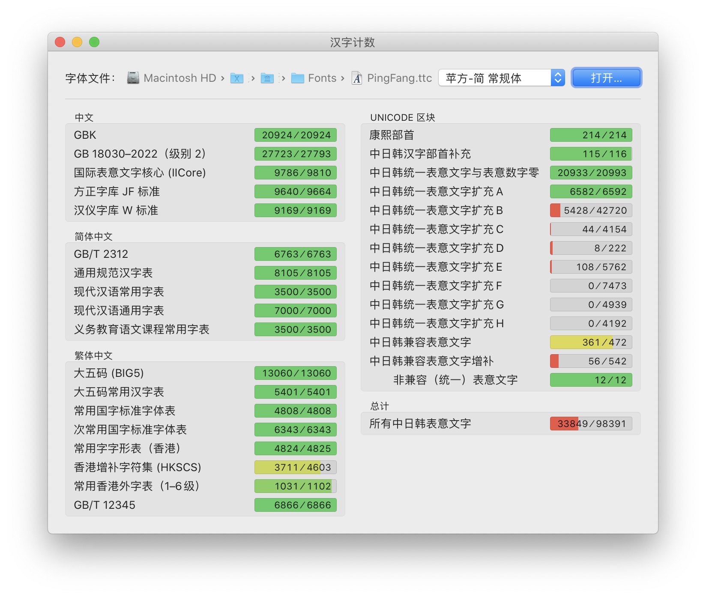
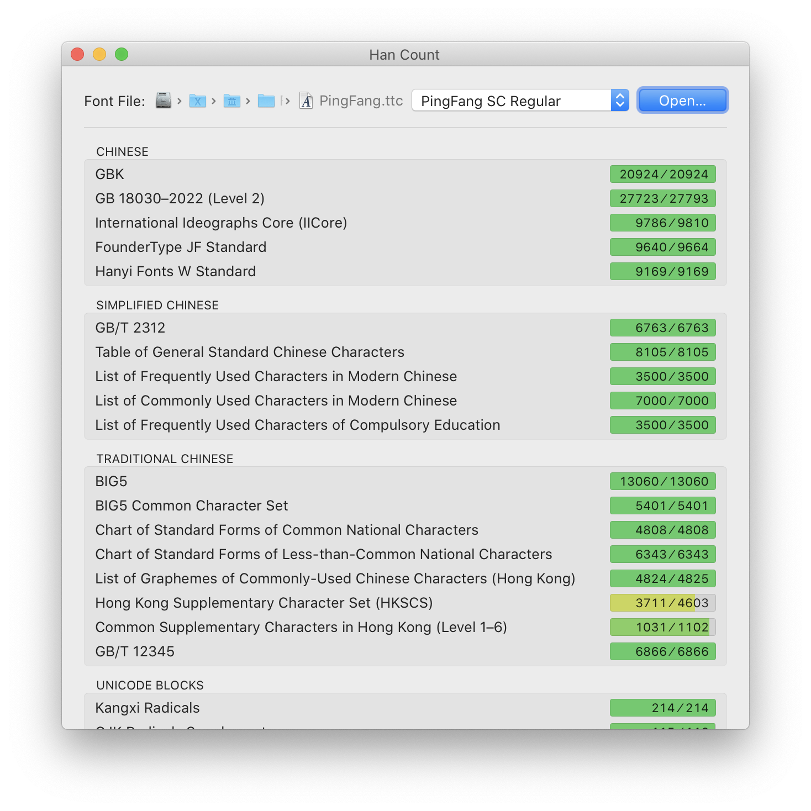

# Han Count

This app counts the number of Han characters in a font which are contained by Unicode blocks and Chinese encoding standards. It is the Mac version of [CJK-character-count](//github.com/NightFurySL2001/CJK-character-count), rewritten with native APIs.

## Supported font formats

Files with one of the extensions `*.ttf`, `*.ttc`, `*.otf`, `*.otc`, `*.woff`, `*.woff2`, `*.dfont`.

## License

The code of this app is licensed under MIT License (see `LICENSE.txt`). The image resources of this app are licensed under [CC BY-NC 4.0](https://creativecommons.org/licenses/by-nc/4.0/).

## How this works

The character set of a font, typically defined in the `cmap` table, can be provided by CoreText. The app creates an intersection the character set of the font with a specified one, and counts the number of characters in it.

## Dependencies

None.

## To build

Build with Xcode 12.4 or above.

## To add a Unicode block / encoding standard

A Unicode block / encoding standard, called a `record` in this app, is defined in `CodePointSets.plist`. The currently supported records are the same as [CJK-character-count](//github.com/NightFurySL2001/CJK-character-count#currently-supported-encoding-standardstandardization-list-支援的编码标准汉字表).

Since property lists are too verbose, you'd like to edit `CodePointSets.json`, which will be converted into a property list when building.

A record is a dictionary with three entries: 

- `key`: A string. The display name of the record will be the localized string of 'code-point-set-*key*'.
- `group`: A string. The display name of the group of the record will be the localized string of 'code-point-set-group-*group*'.
- `value`: A string containing all characters to be included, or an array whose elements are contiguously the upper and lower bounds of several closed ranges of Unicode.

## Todo

- Add help messages for records. (`- [InfoRow setMessage:]`)
- If the remaining count is less than 256, list and allow the user to copy a string consisting of all missing characters. (`CFCharacterSetCreateCoverageString(::)`)

## Screenshots

